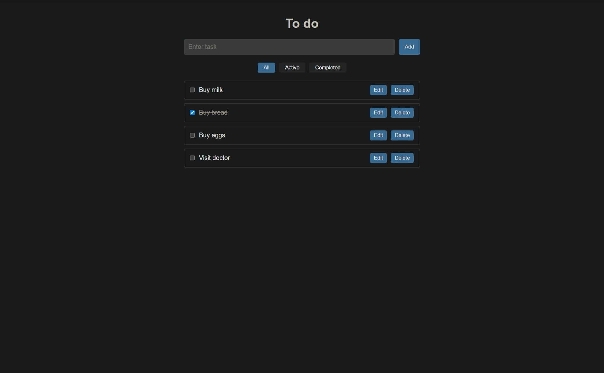

# ChatApp Todo List



A task management app built with:
- React
- Redux Toolkit
- TypeScript
- create-react-app
- react-dnd
- uuid

Features:
- Filtering by task type (active, completed or all)
- Drag-and-drop task reordering 
- UUID generation for task IDs


## Getting Started

### Prerequisites
- Node.js v16+ (LTS versions recommended)
- npm or yarn

### Installation & Running

```bash
npm i
npm start
```

The app opens at `http://localhost:3000` with hot reload on code changes.

### Building for production

```bash
npm run build
```

The production build outputs to `build/` and is ready to deploy.